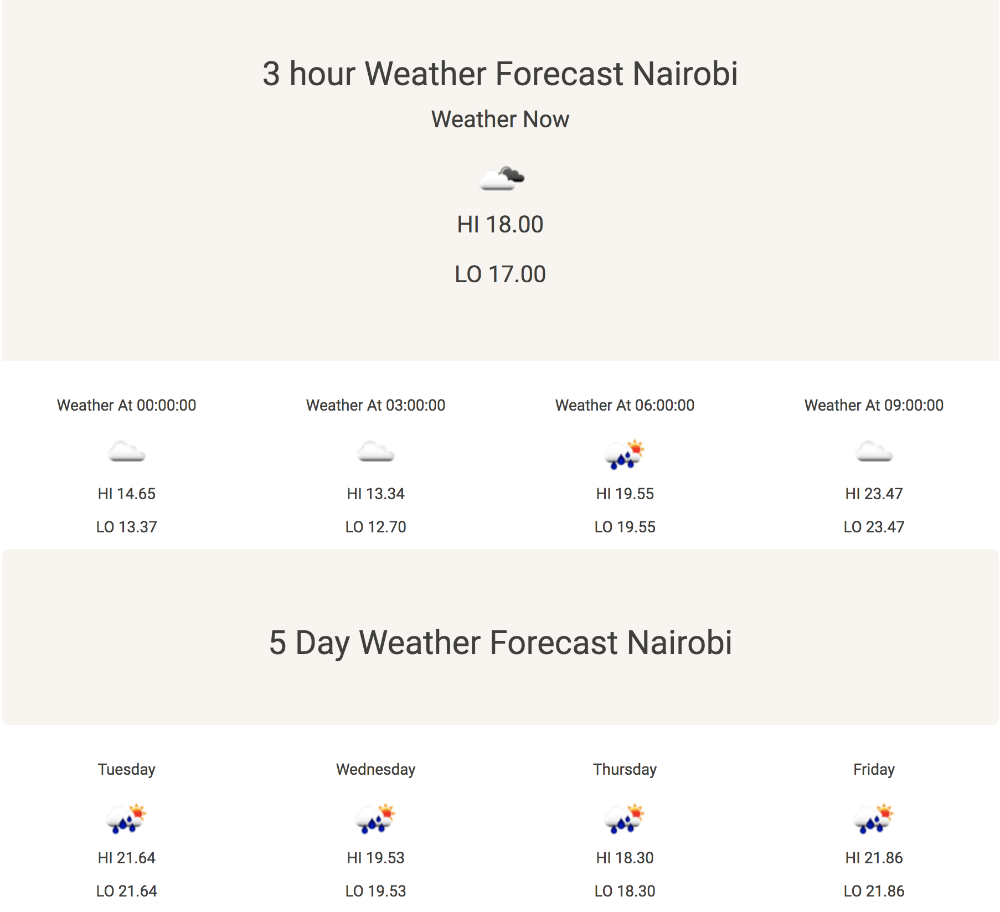

# Weather App 
## This is a simple React + Redux consuming [Open Weather Map API](https://openweathermap.org/api) weather API

#### Features
- The app is able to automatically fetch your current location
- The app is able to get weather information of your current location
- The app displays a 3 hour weather forecast
- The app displays a 5 day weather forecast

Example Screen Shot

